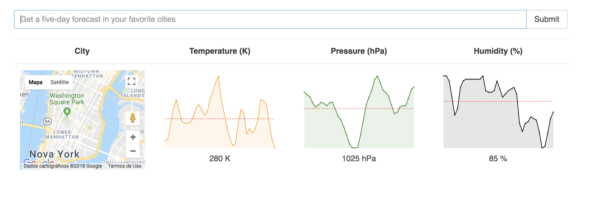

<p align="center">
  
</p>

# React Redux Blog

React Weather Project for United States cities. Use an API for backend requests.<p>
This was one project from [Udemy React Course](https://www.udemy.com/react-redux/).<p>

Demo : ---

## User Interface



## Buzzwords

* React
* Google Maps
* SparkLines Graph
* Axios
* Redux
* Webpack
* ES6

## Folder Structure

```
redux-weather/
  images/
  README.md
  node_modules/
  package.json
  public/
    index.html
    favicon.ico
  src/
    actions/
      index.js
    components/
      chart.js
      google_map.js
    containers/
      search_bar.js
      weather_list.js
    reducers/
      index.js
      reducer_weather.js
    App.css
    App.js
    App.test.js
    index.css
    index.js
    logo.svg
```

## Instalation

```bash
$ git@github.com:andremartingo/redux-weather.git
$ cd redux-weather
$ npm install
```

## Usage

```bash
$ npm start
$ open browser and go to: localhost:8080
```
